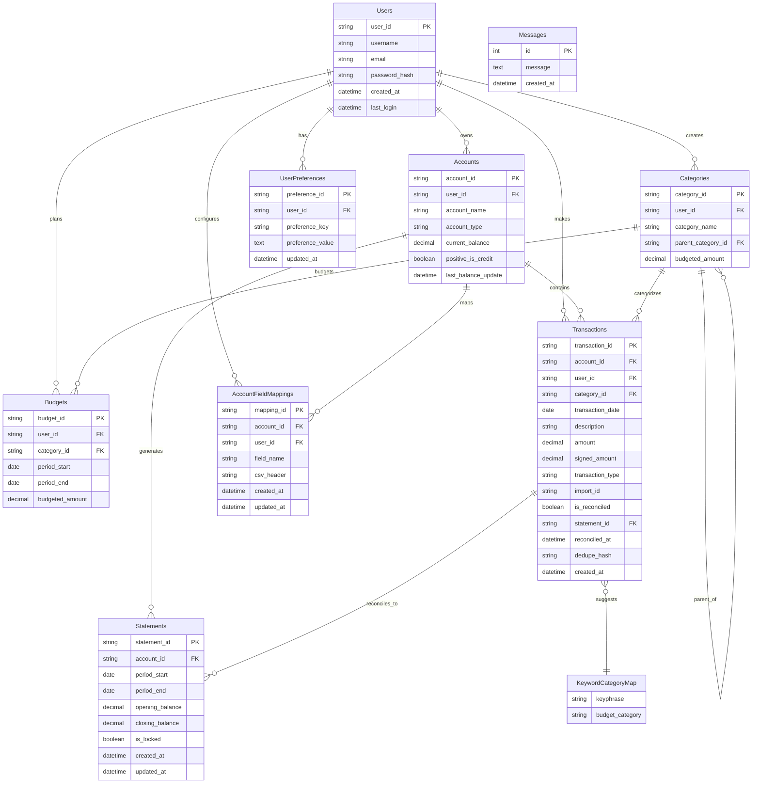

# Data Access Layer (DAO) Summary

## Overview

The application uses a **Data Access Object (DAO) pattern** to abstract database operations from business logic. All DAOs provide **CRUD operations** (Create, Read, Update, Delete) and implement **user-scoped security** to ensure data isolation between users. The system uses **SQLite** as the database with **UUID primary keys** and **callback-based asynchronous operations**.

## Common Patterns Across All DAOs

- **User Scoping**: All operations are scoped to specific users for security
- **UUID Primary Keys**: All entities use UUID v4 for unique identification
- **Callback Pattern**: Asynchronous operations use Node.js callback pattern
- **Error Handling**: Consistent error handling with callback(err, result) pattern
- **Backward Compatibility**: Support for both user-scoped and legacy non-scoped operations
- **Transaction Safety**: Critical operations use database transactions
- **Input Validation**: All inputs are validated before database operations

## DAO Models Detail Table

| DAO Model | Primary Purpose | Key Features | Special Operations |
|-----------|----------------|--------------|-------------------|
| **Account DAO** | Manages financial accounts and statements | Balance tracking, statement management, reconciliation support | `updateAccountBalance()`, `getReconciliationSummary()`, `createStatement()` |
| **Budget DAO** | Handles budget planning and tracking | Period-based budgets, category association, bulk operations | `bulkUpsert()`, `list()` with date filtering, validation with category existence |
| **Category DAO** | Manages transaction categories | Hierarchical categories, parent-child relationships | `bulkCreateCategories()`, parent category validation, usage checking before deletion |
| **Transaction DAO** | Core transaction management | Import/export, reconciliation, balance calculations | `importTransactions()`, `markTransactionReconciled()`, `batchMarkReconciled()` |
| **User DAO** | User authentication and management | Password hashing with bcrypt, login tracking | `createUser()` with bcrypt, `updateLastLogin()`, secure password handling |
| **Account Field Mapping DAO** | CSV import field mapping | Maps CSV headers to account fields | `saveMappings()` with transaction safety, bulk operations |
| **Keyword Category Map DAO** | Auto-categorization | Smart category suggestions based on transaction descriptions | `findMatchingCategory()` with longest match algorithm |
| **Messages DAO** | Simple messaging system | Basic CRUD for messages | Standard CRUD operations only |
| **Testing DAO** | Development testing utilities | Test data queries | `test()` method for development debugging |
| **User Preferences DAO** | User settings and preferences | JSON-based preference storage | `setPreference()` with upsert, JSON serialization |

## Entity Relationship Diagram

[1 tool called]

Let me create the diagrams using Mermaid syntax in the response:

## Entity Relationship Diagram

## Class Diagram - DAO Architecture

```mermaid
classDiagram
    class BaseDAO {
        <<interface>>
        +getConnection()
        +validateInput()
        +handleError()
    }
    
    class AccountDAO {
        +getAllAccounts(userId, callback)
        +getAccountById(accountId, userId, callback)
        +createAccount(account, callback)
        +updateAccount(accountId, account, userId, callback)
        +deleteAccount(accountId, userId, callback)
        +updateAccountBalance(accountId, amount, callback)
        +createStatement(statement, callback)
        +getStatementsByAccount(accountId, callback)
        +getReconciliationSummary(userId, callback)
    }
    
    class BudgetDAO {
        +list(options, callback)
        +findById(id, callback)
        +create(budget, callback)
        +update(id, changes, callback)
        +remove(id, callback)
        +bulkUpsert(budgets, callback)
        -validateBudget(budget)
        -ensureCategoryExists(categoryId)
    }
    
    class CategoryDAO {
        +getAllCategories(userId, callback)
        +getCategoryById(categoryId, userId, callback)
        +createCategory(category, callback)
        +bulkCreateCategories(categories, callback)
        +updateCategory(categoryId, category, userId, callback)
        +deleteCategory(categoryId, userId, callback)
    }
    
    class TransactionDAO {
        +getAllTransactions(userId, startDate, endDate)
        +createTransaction(transaction, userId)
        +updateTransaction(id, transaction, userId)
        +deleteTransaction(id, userId, callback)
        +batchDeleteTransactions(transactionIds, userId, callback)
        +importTransactions(records)
        +markTransactionReconciled(transactionId, statementId, callback)
        +batchMarkReconciled(transactionIds, statementId, callback)
        +getReconciliationStatus(accountId, periodStart, periodEnd, callback)
        +setCSVData(headers, records)
        +getCSVData()
    }
    
    class UserDAO {
        +createUser(user, callback)
        +getUserByEmail(email, callback)
        +getUserByUsername(username, callback)
        +getUserById(userId, callback)
        +updateUser(userId, userData, callback)
        +deleteUser(userId, callback)
        +updateLastLogin(userId, callback)
        +getAllUsers(callback)
    }
    
    class AccountFieldMappingDAO {
        +getMappingsByAccountId(accountId, userId, callback)
        +getMappingById(mappingId, userId, callback)
        +createMapping(mapping, userId, callback)
        +updateMapping(mappingId, mapping, userId, callback)
        +deleteMapping(mappingId, userId, callback)
        +saveMappings(accountId, mappings, userId, callback)
    }
    
    class KeywordCategoryMapDAO {
        +findMatchingCategory(description)
        +getAllMappings()
    }
    
    class UserPreferencesDAO {
        +getPreference(userId, preferenceKey, callback)
        +setPreference(userId, preferenceKey, preferenceValue, callback)
        +getAllPreferences(userId, callback)
        +deletePreference(userId, preferenceKey, callback)
        +deleteAllPreferences(userId, callback)
    }
    
    class MessagesDAO {
        +createMessage(message, callback)
        +getAllMessages(callback)
        +getMessageById(id, callback)
        +updateMessage(id, message, callback)
        +deleteMessage(id, callback)
    }
    
    class TestingDAO {
        +test(req, res)
    }
    
    BaseDAO <|-- AccountDAO
    BaseDAO <|-- BudgetDAO
    BaseDAO <|-- CategoryDAO
    BaseDAO <|-- TransactionDAO
    BaseDAO <|-- UserDAO
    BaseDAO <|-- AccountFieldMappingDAO
    BaseDAO <|-- KeywordCategoryMapDAO
    BaseDAO <|-- UserPreferencesDAO
    BaseDAO <|-- MessagesDAO
    BaseDAO <|-- TestingDAO
```

## Security Features

### User Scoping
All DAOs implement **user-scoped security** where:
- Every operation requires a `userId` parameter
- Database queries include `WHERE user_id = ?` clauses
- Users can only access their own data
- Backward compatibility maintained for internal operations

### Password Security
- **bcrypt hashing** with configurable rounds (default: 12)
- Environment variable `BCRYPT_ROUNDS` for customization
- OWASP 2025 recommendations followed
- Passwords never stored in plain text

### Input Validation
- **UUID validation** for all primary keys
- **Date range validation** for periods and statements
- **Foreign key validation** (e.g., category existence for budgets)
- **Business rule validation** (e.g., period_start ≤ period_end)

## Key Business Logic

### Balance Management
- **Automatic balance updates** when transactions are created/modified
- **Signed amount calculations** based on account type and transaction type
- **Balance reconciliation** with statement periods
- **Account type handling** (credit vs debit accounts)

### Transaction Import
- **CSV import with field mapping** using AccountFieldMappingDAO
- **Duplicate detection** using dedupe_hash
- **Batch processing** with transaction safety
- **Auto-categorization** using KeywordCategoryMapDAO

### Reconciliation System
- **Statement-based reconciliation** linking transactions to statement periods
- **Batch reconciliation** operations
- **Reconciliation status tracking** (reconciled/unreconciled)
- **Period-based transaction filtering**

### Budget Management
- **Period-based budgets** with start/end dates
- **Category association** with validation
- **Bulk operations** for efficient data management
- **Overlap detection** for budget periods

[1 tool called]

## Summary

The data access layer implements a robust, secure, and scalable architecture for a financial management application. The system uses:

- **10 DAO models** covering all business entities
- **User-scoped security** ensuring data isolation
- **Comprehensive CRUD operations** with specialized business logic
- **Transaction safety** for critical operations
- **Advanced features** like reconciliation, import/export, and auto-categorization
- **Modern security practices** including bcrypt password hashing
- **Flexible architecture** supporting both callback and promise patterns

The DAO pattern provides clean separation between data access and business logic, making the system maintainable and testable while ensuring data integrity and security across all operations.