# Controller Layer Summary

## Overview

The controller layer implements the **MVC (Model-View-Controller) pattern** and serves as the **business logic layer** between HTTP requests and the data access layer. All controllers provide **RESTful API endpoints** with **user-scoped security**, **input validation**, and **comprehensive error handling**. The system uses **Express.js** with **JWT authentication** and implements **async/await** patterns for modern JavaScript development.

## Common Patterns Across All Controllers

- **Authentication Required**: All endpoints require JWT authentication via `req.user?.user_id`
- **User Scoping**: All operations are scoped to authenticated users for security
- **Input Validation**: Comprehensive validation of request parameters and body data
- **Error Handling**: Consistent HTTP status codes and error message formatting
- **RESTful Design**: Standard HTTP methods (GET, POST, PUT, DELETE) with proper status codes
- **Async/Await**: Modern JavaScript patterns for handling asynchronous operations
- **Service Integration**: Controllers orchestrate multiple DAOs and services for complex operations

## Controller Models Detail Table

| Controller | Primary Purpose | Key Features | Special Operations |
|------------|----------------|--------------|-------------------|
| **Account Controller** | Manages financial accounts and balance operations | Account CRUD, balance updates, reconciliation summary | `updateAccountBalance()`, `getReconciliationSummary()`, admin access controls |
| **Budget Controller** | Handles budget planning and management | Period-based budgets, bulk operations, validation | `bulkUpsert()`, date filtering, category validation |
| **Category Controller** | Manages transaction categories and auto-categorization | Category CRUD, bulk creation, keyword rules, suggestion feedback | `bulkCreateCategories()`, `getKeywordRules()`, `saveSuggestionFeedback()` |
| **Transaction Controller** | Core transaction management and CSV import | Import/export, reconciliation, balance calculations, CSV processing | `uploadTransactions()`, `previewCSV()`, `batchDeleteTransactions()` |
| **User Controller** | User authentication and profile management | Registration, login, profile updates, JWT tokens | `loginUser()`, `createUser()`, bcrypt password hashing |
| **Account Field Mapping Controller** | CSV import field mapping configuration | Maps CSV headers to account fields | `saveMappings()`, bulk mapping operations |
| **Actuals Controller** | Read-only financial data aggregation | Account/category/budget actuals, feature flags, strict/legacy modes | `getAccountActuals()`, `getCategoryActuals()`, `getBudgetActuals()` |
| **Auto Search Keyword Controller** | Smart category suggestions | Keyword-based category matching | `searchKeywordsForCategory()` with longest match algorithm |
| **Messages Controller** | Simple messaging system | Basic CRUD for messages | Standard CRUD operations with validation |
| **Reporting Controller** | Financial reporting and analytics | Monthly summaries, budget vs actual, weekly actuals | `getMonthlySummary()`, `getBudgetVsActual()`, `getWeeklyCategoryActuals()` |
| **Statement Controller** | Bank statement management and reconciliation | Statement CRUD, reconciliation, smart defaults | `createStatement()`, `reconcileTransaction()`, `getStatementDefaults()` |
| **Testing Controller** | Development testing utilities | Test data queries and debugging | `testQuery()` for development debugging |
| **User Preferences Controller** | User settings and preferences | JSON-based preference storage, batch operations | `batchSetPreferences()`, JSON serialization, N+1 query optimization |

## Controller Architecture Diagram

```mermaid
classDiagram
    class BaseController {
        <<interface>>
        +validateAuth()
        +validateInput()
        +handleError()
        +formatResponse()
    }
    
    class AccountController {
        +getAllAccounts(req, res)
        +getAccountById(req, res)
        +createAccount(req, res)
        +updateAccount(req, res)
        +deleteAccount(req, res)
        +updateAccountBalance(req, res)
        +getReconciliationSummary(req, res)
    }
    
    class BudgetController {
        +list(req, res)
        +create(req, res)
        +update(req, res)
        +remove(req, res)
        +bulkUpsert(req, res)
    }
    
    class CategoryController {
        +getAllCategories(req, res)
        +getCategoryById(req, res)
        +createCategory(req, res)
        +bulkCreateCategories(req, res)
        +updateCategory(req, res)
        +deleteCategory(req, res)
        +getKeywordRules(req, res)
        +saveSuggestionFeedback(req, res)
    }
    
    class TransactionController {
        +getTransactions(req, res)
        +getTransactionById(req, res)
        +createTransaction(req, res)
        +updateTransaction(req, res)
        +deleteTransaction(req, res)
        +batchDeleteTransactions(req, res)
        +previewCSV(req, res)
        +uploadTransactions(req, res)
        +getImportLogs(req, res)
    }
    
    class UserController {
        +createUser(req, res)
        +loginUser(req, res)
        +logoutUser(req, res)
        +getCurrentUser(req, res)
        +updateCurrentUser(req, res)
        +updateUser(req, res)
        +deleteUser(req, res)
        +getAllUsers(req, res)
        +getUserById(req, res)
    }
    
    class ActualsController {
        +getAccountActuals(req, res)
        +getCategoryActuals(req, res)
        +getBudgetActuals(req, res)
        +getStatementActuals(req, res)
        +getFeatureFlags(req, res)
    }
    
    class ReportingController {
        +getMonthlySummary(req, res)
        +getBudgetVsActual(req, res)
        +getWeeklyCategoryActuals(req, res)
        +getAccountBalancesAsOf(req, res)
    }
    
    class StatementController {
        +createStatement(req, res)
        +getStatementsByAccount(req, res)
        +getStatementById(req, res)
        +updateStatement(req, res)
        +deleteStatement(req, res)
        +reconcileTransaction(req, res)
        +batchReconcileTransactions(req, res)
        +getReconciliationStatus(req, res)
        +reconcileStatement(req, res)
        +getStatementDefaults(req, res)
    }
    
    class UserPreferencesController {
        +getAllPreferences(req, res)
        +getPreference(req, res)
        +setPreference(req, res)
        +batchSetPreferences(req, res)
        +deletePreference(req, res)
    }
    
    BaseController <|-- AccountController
    BaseController <|-- BudgetController
    BaseController <|-- CategoryController
    BaseController <|-- TransactionController
    BaseController <|-- UserController
    BaseController <|-- ActualsController
    BaseController <|-- ReportingController
    BaseController <|-- StatementController
    BaseController <|-- UserPreferencesController
```



## Request Flow Diagram


## Security Features

### Authentication & Authorization
- **JWT Token Validation**: All endpoints require valid JWT tokens
- **User Scoping**: Operations are automatically scoped to authenticated user
- **Role-Based Access**: Admin endpoints check user roles
- **Password Security**: bcrypt hashing with configurable rounds (default: 12)

### Input Validation
- **Parameter Validation**: All route parameters validated
- **Body Validation**: Request body data validated for required fields
- **Type Validation**: Data types checked (numbers, dates, booleans)
- **Format Validation**: Date formats, email formats, UUID formats
- **Business Rule Validation**: Custom validation for business logic

### Error Handling
- **HTTP Status Codes**: Proper status codes (200, 201, 400, 401, 403, 404, 409, 500)
- **Error Messages**: User-friendly error messages
- **Logging**: Comprehensive error logging for debugging
- **Graceful Degradation**: Fallback responses for service failures

## Key Business Logic

### Transaction Management
- **CSV Import**: Multi-format CSV parsing with field mapping
- **Duplicate Detection**: SHA-256 hash-based duplicate prevention
- **Balance Updates**: Automatic account balance calculations
- **Reconciliation**: Statement-based transaction reconciliation
- **Batch Operations**: Efficient bulk transaction operations

### Financial Calculations
- **Signed Amounts**: Account-type aware amount calculations
- **Budget vs Actual**: Period-based budget tracking with variance analysis
- **Monthly Summaries**: Income/expense aggregation by month
- **Reconciliation**: Statement balance validation and transaction matching

### Data Import/Export
- **CSV Processing**: Flexible CSV import with field mapping
- **Date Parsing**: Multiple date format support
- **Data Validation**: Comprehensive import data validation
- **Error Reporting**: Detailed import error reporting

### User Experience
- **Smart Defaults**: Intelligent default values for new records
- **Bulk Operations**: Efficient batch operations for large datasets
- **Real-time Validation**: Immediate feedback on data entry
- **Progressive Enhancement**: Graceful fallbacks for missing data

## API Design Patterns

### RESTful Endpoints
- **GET**: Retrieve data (with optional filtering)
- **POST**: Create new resources
- **PUT/PATCH**: Update existing resources
- **DELETE**: Remove resources
- **Consistent URL Structure**: `/api/{resource}/{id?}` pattern

### Response Format
```json
{
  "data": {}, // Success response data
  "message": "Operation successful", // User-friendly message
  "error": "Error description", // Error response
  "meta": {} // Additional metadata
}
```

### Query Parameters
- **Filtering**: `?startDate=2024-01-01&endDate=2024-12-31`
- **Pagination**: `?page=1&limit=50`
- **Sorting**: `?sortBy=date&sortOrder=desc`
- **Mode Selection**: `?mode=strict|legacy`

### Batch Operations
- **Bulk Create**: Array of objects in request body
- **Bulk Update**: Array of IDs with update data
- **Bulk Delete**: Array of IDs to delete
- **Transaction Safety**: Database transactions for consistency

## Performance Optimizations

### Database Efficiency
- **Prepared Statements**: SQL injection prevention and performance
- **Batch Operations**: Reduced database round trips
- **Indexing**: Optimized queries with proper indexes
- **Connection Pooling**: Efficient database connection management

### Caching Strategies
- **Response Caching**: ETag headers for conditional requests
- **Query Result Caching**: In-memory caching for frequently accessed data
- **Static Asset Caching**: Client-side caching for static resources

### N+1 Query Prevention
- **Batch Loading**: Single queries for multiple related records
- **Eager Loading**: Pre-loading related data in single queries
- **Query Optimization**: Efficient JOIN operations

## Error Handling Patterns

### Validation Errors (400)
```json
{
  "error": "Validation failed",
  "details": {
    "field": "Field name is required",
    "email": "Invalid email format"
  }
}
```

### Authentication Errors (401)
```json
{
  "error": "Authentication required"
}
```

### Authorization Errors (403)
```json
{
  "error": "Access denied: Cannot access other user data"
}
```

### Not Found Errors (404)
```json
{
  "error": "Resource not found or access denied"
}
```

### Conflict Errors (409)
```json
{
  "error": "Resource already exists or constraint violation"
}
```

### Server Errors (500)
```json
{
  "error": "Internal server error"
}
```

## Summary

The controller layer provides a robust, secure, and scalable API for a financial management application. The system implements:

- **13 Controllers** covering all business domains
- **RESTful API design** with consistent patterns
- **Comprehensive security** with JWT authentication and user scoping
- **Advanced features** like CSV import, reconciliation, and reporting
- **Performance optimizations** including batch operations and caching
- **Modern JavaScript patterns** with async/await and proper error handling
- **Flexible architecture** supporting both strict and legacy modes

The controller pattern provides clean separation between HTTP handling and business logic, making the system maintainable, testable, and secure while ensuring data integrity and optimal performance across all operations.
