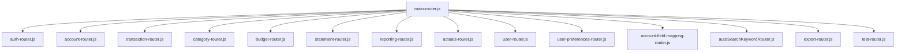

# Routing and Endpoint Documentation

## Overview

The application implements a **modular routing architecture** using Express.js with **RESTful API design principles**. The routing system is organized into **domain-specific route modules** that handle different aspects of the financial management application. All routes implement **comprehensive security**, **input validation**, and **user-scoped data access**.

## Routing Architecture

### Route Organization Structure
```
/api/
├── /auth/                    # Authentication endpoints
├── /accounts/                # Account management
├── /transactions/            # Transaction operations
├── /categories/              # Category management
├── /budgets/                 # Budget planning
├── /statements/              # Statement reconciliation
├── /reports/                 # Financial reporting
├── /actuals/                 # Read-only financial data
├── /users/                   # User management
├── /user-preferences/        # User settings
├── /account-field-mappings/  # CSV import mapping
├── /autocatfind/            # Auto-categorization
├── /export/                 # Data export
└── /test/                   # Development testing
```

### Route Module Dependencies


---

## Authentication Routes (`/api/auth/`)

### Endpoint Overview
| Method | Endpoint | Purpose | Auth Required |
|--------|----------|---------|---------------|
| POST | `/login` | User authentication | No |
| POST | `/refresh` | Token refresh | No (cookie-based) |
| POST | `/logout` | User logout | No |
| GET | `/me` | Current user info | Yes |

### Detailed Endpoints

#### POST `/api/auth/login`
**Purpose**: Authenticate user and return access/refresh tokens

**Request Body**:
```json
{
  "username": "string", // OR email
  "email": "string",    // OR username  
  "password": "string"
}
```

**Response**:
```json
{
  "success": true,
  "accessToken": "jwt_token",
  "user": {
    "user_id": "uuid",
    "username": "string",
    "email": "string",
    "role": "user|admin"
  }
}
```

**Security Features**:
- Rate limiting (`authLimiter`)
- Input sanitization
- Password validation
- Security logging
- HTTP-only refresh token cookie

#### POST `/api/auth/refresh`
**Purpose**: Refresh access token using refresh token cookie

**Request**: Cookie-based (no body required)

**Response**:
```json
{
  "success": true,
  "accessToken": "new_jwt_token",
  "user": {
    "user_id": "uuid",
    "username": "string", 
    "email": "string",
    "role": "user|admin"
  }
}
```

**Security Features**:
- Token rotation (new refresh token generated)
- Production cookie security (`__Host-` prefix)
- Automatic cookie cleanup on invalid tokens

#### POST `/api/auth/logout`
**Purpose**: Clear refresh token cookie

**Response**:
```json
{
  "success": true,
  "message": "Logged out successfully"
}
```

#### GET `/api/auth/me`
**Purpose**: Get current authenticated user information

**Response**:
```json
{
  "success": true,
  "user": {
    "user_id": "uuid",
    "username": "string",
    "email": "string", 
    "role": "user|admin",
    "created_at": "timestamp",
    "last_login": "timestamp"
  }
}
```

---

## Account Routes (`/api/accounts/`)

### Endpoint Overview
| Method | Endpoint | Purpose | Auth Required |
|--------|----------|---------|---------------|
| GET | `/` | Get all user accounts | Yes |
| GET | `/:id` | Get account by ID | Yes |
| GET | `/user/:userId` | Get accounts by user ID | Yes (admin/self) |
| POST | `/` | Create new account | Yes |
| PUT | `/:id` | Update account | Yes |
| DELETE | `/:id` | Delete account | Yes |
| PATCH | `/:id/balance` | Update account balance | Yes |
| GET | `/reconciliation-summary` | Get reconciliation summary | Yes |
| GET | `/:id/statements` | Get account statements | Yes |

### Detailed Endpoints

#### GET `/api/accounts/`
**Purpose**: Retrieve all accounts for authenticated user

**Query Parameters**: None

**Response**:
```json
[
  {
    "account_id": "uuid",
    "account_name": "string",
    "account_type": "string",
    "current_balance": "number",
    "positive_is_credit": "boolean",
    "last_balance_update": "timestamp"
  }
]
```

#### POST `/api/accounts/`
**Purpose**: Create a new account

**Request Body**:
```json
{
  "name": "string",              // OR account_name
  "account_name": "string",      // Takes precedence over name
  "account_type": "string",
  "positive_is_credit": "boolean", // Default: true
  "current_balance": "number",   // Default: 0
  "last_balance_update": "timestamp" // Optional
}
```

**Response**:
```json
{
  "id": "uuid"
}
```

#### PATCH `/api/accounts/:id/balance`
**Purpose**: Update account balance

**Request Body**:
```json
{
  "amount": "number",        // OR signed_amount
  "signed_amount": "number"  // Takes precedence over amount
}
```

---

## Transaction Routes (`/api/transactions/`)

### Endpoint Overview
| Method | Endpoint | Purpose | Auth Required |
|--------|----------|---------|---------------|
| GET | `/` | Get user transactions | Yes |
| GET | `/:id` | Get transaction by ID | Yes |
| POST | `/` | Create transaction | Yes |
| PUT | `/:id` | Update transaction | Yes |
| DELETE | `/:id` | Delete transaction | Yes |
| POST | `/batch` | Batch delete transactions | Yes |
| POST | `/preview` | Preview CSV import | Yes |
| POST | `/upload` | Upload CSV transactions | Yes |
| POST | `/import` | Alternative upload endpoint | Yes |
| GET | `/import/logs` | Get import history | Yes |
| PUT | `/:id/reconcile` | Reconcile transaction | Yes |

### Detailed Endpoints

#### POST `/api/transactions/preview`
**Purpose**: Preview CSV file before import

**Request**: Multipart form data
- `file`: CSV file
- `mappings`: JSON string of field mappings (optional)
- `account_id`: Account ID for duplicate checking (optional)

**Response**:
```json
{
  "records": [
    {
      "transaction_date": "2024-01-15",
      "description": "string",
      "amount": "number",
      "transaction_type": "C|D"
    }
  ],
  "duplicates": [
    {
      "hash": "sha256_hash",
      "record": {},
      "line": "number"
    }
  ],
  "totalRecords": "number",
  "duplicateCount": "number"
}
```

#### POST `/api/transactions/upload`
**Purpose**: Import transactions from CSV

**Request**: Multipart form data
- `file`: CSV file (required)
- `account_id`: Account ID (required)
- `mappings`: JSON string of field mappings (optional)
- `categoryAssignments`: JSON string of category assignments (optional)
- `selected_indices`: JSON array of duplicate indices to import (optional)

**Response**:
```json
{
  "importedCount": "number",
  "duplicateCount": "number"
}
```

#### POST `/api/transactions/batch`
**Purpose**: Batch delete multiple transactions

**Request Body**:
```json
{
  "transactionIds": ["uuid1", "uuid2", "uuid3"]
}
```

**Response**:
```json
{
  "message": "X transaction(s) deleted successfully"
}
```

---

## Category Routes (`/api/categories/`)

### Endpoint Overview
| Method | Endpoint | Purpose | Auth Required |
|--------|----------|---------|---------------|
| GET | `/` | Get all categories | Yes |
| GET | `/:id` | Get category by ID | Yes |
| GET | `/user/:userId` | Get categories by user ID | Yes (admin/self) |
| POST | `/` | Create category | Yes |
| PUT | `/:id` | Update category | Yes |
| DELETE | `/:id` | Delete category | Yes |
| POST | `/bulk` | Bulk create categories | Yes |
| GET | `/keyword-rules` | Get keyword rules | Yes |
| POST | `/keyword-rules` | Add keyword rule | Yes |
| GET | `/suggestion-feedback` | Get suggestion feedback | Yes |
| POST | `/suggestion-feedback` | Save suggestion feedback | Yes |

### Detailed Endpoints

#### POST `/api/categories/bulk`
**Purpose**: Create multiple categories in one request

**Request Body**:
```json
[
  {
    "category_name": "string",
    "parent_category_id": "uuid", // Optional
    "budgeted_amount": "number"   // Optional
  }
]
```

**Response**:
```json
{
  "message": "X categories created successfully",
  "created": [
    {
      "category_id": "uuid",
      "category_name": "string",
      "user_id": "uuid"
    }
  ]
}
```

#### POST `/api/categories/suggestion-feedback`
**Purpose**: Provide feedback on category suggestions

**Request Body**:
```json
{
  "transaction_id": "uuid",
  "description": "string",
  "amount": "number",
  "suggested_category_id": "uuid",
  "accepted": "boolean"
}
```

---

## Budget Routes (`/api/budgets/`)

### Endpoint Overview
| Method | Endpoint | Purpose | Auth Required |
|--------|----------|---------|---------------|
| GET | `/` | List budgets | Yes |
| POST | `/` | Create budget | Yes |
| PUT | `/:id` | Update budget | Yes |
| DELETE | `/:id` | Delete budget | Yes |
| POST | `/bulk` | Bulk upsert budgets | Yes |

### Detailed Endpoints

#### GET `/api/budgets/`
**Purpose**: List budgets with optional filtering

**Query Parameters**:
- `periodStart`: Start date filter (YYYY-MM-DD)
- `periodEnd`: End date filter (YYYY-MM-DD)
- `categoryId`: Category ID filter

**Response**:
```json
[
  {
    "budget_id": "uuid",
    "user_id": "uuid",
    "category_id": "uuid",
    "category_name": "string",
    "period_start": "YYYY-MM-DD",
    "period_end": "YYYY-MM-DD",
    "budgeted_amount": "number"
  }
]
```

#### POST `/api/budgets/bulk`
**Purpose**: Bulk create or update budgets

**Request Body**:
```json
[
  {
    "budget_id": "uuid",        // Optional for new budgets
    "user_id": "uuid",
    "category_id": "uuid",
    "period_start": "YYYY-MM-DD",
    "period_end": "YYYY-MM-DD",
    "budgeted_amount": "number"
  }
]
```

**Response**:
```json
{
  "message": "Successfully processed X budget records",
  "results": [
    {
      "budget_id": "uuid",
      "created": true,    // OR "updated": true
    }
  ]
}
```

---

## Statement Routes (`/api/statements/`)

### Endpoint Overview
| Method | Endpoint | Purpose | Auth Required |
|--------|----------|---------|---------------|
| GET | `/defaults` | Get statement defaults | Yes |
| POST | `/` | Create statement | Yes |
| GET | `/:id` | Get statement by ID | Yes |
| PUT | `/:id` | Update statement | Yes |
| DELETE | `/:id` | Delete statement | Yes |
| POST | `/:id/reconcile` | Reconcile statement | Yes |
| GET | `/:id/reconciliation-status` | Get reconciliation status | Yes |
| GET | `/:id/validate-reconciliation` | Validate reconciliation | Yes |
| GET | `/:id/transactions` | Get statement transactions | Yes |
| POST | `/reconcile/batch` | Batch reconcile transactions | Yes |
| GET | `/reconciliation/status` | Get reconciliation status | Yes |
| GET | `/reconciliation/unreconciled` | Get unreconciled transactions | Yes |

### Detailed Endpoints

#### GET `/api/statements/defaults`
**Purpose**: Get smart defaults for creating new statement

**Query Parameters**:
- `account_id`: Account ID (required)

**Response**:
```json
{
  "defaults": {
    "period_start": "YYYY-MM-DD",
    "opening_balance": "number"
  },
  "has_previous_statement": "boolean",
  "last_statement": {
    "statement_id": "uuid",
    "period_end": "YYYY-MM-DD",
    "closing_balance": "number"
  }
}
```

#### POST `/api/statements/`
**Purpose**: Create a new statement

**Request Body**:
```json
{
  "account_id": "uuid",
  "period_start": "YYYY-MM-DD",    // Optional (smart default)
  "period_end": "YYYY-MM-DD",
  "opening_balance": "number",      // Optional (smart default)
  "closing_balance": "number"
}
```

**Response**:
```json
{
  "statement_id": "uuid",
  "message": "Statement created successfully",
  "reconciliation": {
    "checks": {
      "openingMatchesPrev": "boolean",
      "arithmeticHolds": "boolean"
    },
    "ok": "boolean"
  }
}
```

#### POST `/api/statements/reconcile/batch`
**Purpose**: Batch reconcile multiple transactions

**Request Body**:
```json
{
  "transaction_ids": ["uuid1", "uuid2"],
  "statement_id": "uuid",
  "is_reconciled": "boolean"
}
```

---

## Reporting Routes (`/api/reports/`)

### Endpoint Overview
| Method | Endpoint | Purpose | Auth Required |
|--------|----------|---------|---------------|
| GET | `/monthly-summary` | Get monthly financial summary | Yes |
| GET | `/budget-vs-actual` | Get budget vs actual analysis | Yes |
| GET | `/weekly-category-actuals` | Get weekly category actuals | Yes |
| GET | `/account-balances` | Get account balances as of date | Yes |

### Detailed Endpoints

#### GET `/api/reports/monthly-summary`
**Purpose**: Get monthly income/expense summary

**Query Parameters**:
- `start`: Start date (YYYY-MM-DD, required)
- `end`: End date (YYYY-MM-DD, required)

**Response**:
```json
[
  {
    "month": "YYYY-MM",
    "income": "number",
    "expense": "number", 
    "net": "number"
  }
]
```

#### GET `/api/reports/budget-vs-actual`
**Purpose**: Get budget vs actual analysis

**Query Parameters**:
- `start`: Start date (YYYY-MM-DD, required)
- `end`: End date (YYYY-MM-DD, required)
- `categoryId`: Category ID filter (optional)
- `mode`: 'header' or 'detail' (optional, default: 'header')

**Response**:
```json
[
  {
    "budget_id": "uuid",
    "category_id": "uuid",
    "name": "string",
    "period_start": "YYYY-MM-DD",
    "period_end": "YYYY-MM-DD",
    "budgeted": "number",
    "actual": "number",
    "variance": "number",
    "burnRate": "number"
  }
]
```

---

## Actuals Routes (`/api/actuals/`)

### Endpoint Overview
| Method | Endpoint | Purpose | Auth Required |
|--------|----------|---------|---------------|
| GET | `/accounts` | Get account actuals | Yes |
| GET | `/categories` | Get category actuals | Yes |
| GET | `/budgets` | Get budget actuals | Yes |
| GET | `/statements` | Get statement actuals | Yes |
| GET | `/feature-flags` | Get feature flags | Yes |

### Detailed Endpoints

#### GET `/api/actuals/accounts`
**Purpose**: Get account balances and transaction counts

**Query Parameters**:
- `ids`: Comma-separated account IDs (optional)
- `from`: Start date filter (optional)
- `to`: End date filter (optional)
- `mode`: 'legacy' or 'strict' (optional)

**Response**:
```json
{
  "mode": "strict|legacy",
  "data": [
    {
      "account_id": "uuid",
      "account_name": "string",
      "account_type": "string",
      "current_balance": "number",
      "transaction_count": "number",
      "balance_sum": "number",
      "credit_sum": "number",
      "debit_sum": "number",
      "reconciled_count": "number",
      "reconciled_sum": "number"
    }
  ]
}
```

#### GET `/api/actuals/feature-flags`
**Purpose**: Get current feature flag status

**Response**:
```json
{
  "strictActuals": "boolean"
}
```

---

## User Routes (`/api/users/`)

### Endpoint Overview
| Method | Endpoint | Purpose | Auth Required | Admin Only |
|--------|----------|---------|---------------|------------|
| POST | `/` | Create user | No | No |
| POST | `/login` | User login | No | No |
| POST | `/logout` | User logout | No | No |
| GET | `/profile` | Get current user | Yes | No |
| PUT | `/profile` | Update current user | Yes | No |
| GET | `/` | Get all users | Yes | Yes |
| GET | `/:userId` | Get user by ID | Yes | Yes |
| PUT | `/:userId` | Update user by ID | Yes | Yes |
| DELETE | `/:userId` | Delete user | Yes | Yes |

### Detailed Endpoints

#### POST `/api/users/`
**Purpose**: Create new user account

**Request Body**:
```json
{
  "username": "string",
  "email": "string",
  "password": "string"
}
```

**Response**:
```json
{
  "message": "User created successfully",
  "user_id": "uuid"
}
```

#### PUT `/api/users/profile`
**Purpose**: Update current user profile

**Request Body**:
```json
{
  "username": "string",  // Optional
  "email": "string",     // Optional
  "password": "string"   // Optional
}
```

---

## User Preferences Routes (`/api/user-preferences/`)

### Endpoint Overview
| Method | Endpoint | Purpose | Auth Required |
|--------|----------|---------|---------------|
| GET | `/:userId` | Get all preferences | Yes |
| GET | `/:userId/:preferenceKey` | Get specific preference | Yes |
| POST | `/:userId/:preferenceKey` | Set preference | Yes |
| POST | `/:userId/batch` | Batch set preferences | Yes |
| DELETE | `/:userId/:preferenceKey` | Delete preference | Yes |

### Detailed Endpoints

#### POST `/api/user-preferences/:userId/batch`
**Purpose**: Set multiple preferences in one request

**Request Body**:
```json
{
  "preferences": {
    "theme": "dark",
    "currency": "USD",
    "dateFormat": "MM/DD/YYYY",
    "notifications": {
      "email": true,
      "push": false
    }
  }
}
```

**Response**:
```json
{
  "success": true,
  "count": "number",
  "message": "X preferences saved successfully"
}
```

---

## Account Field Mapping Routes (`/api/account-field-mappings/`)

### Endpoint Overview
| Method | Endpoint | Purpose | Auth Required |
|--------|----------|---------|---------------|
| GET | `/account/:accountId` | Get mappings for account | Yes |
| GET | `/:id` | Get mapping by ID | Yes |
| POST | `/` | Create mapping | Yes |
| PUT | `/:id` | Update mapping | Yes |
| DELETE | `/:id` | Delete mapping | Yes |
| DELETE | `/account/:accountId` | Delete all mappings for account | Yes |
| POST | `/account/:accountId/batch` | Save multiple mappings | Yes |

### Detailed Endpoints

#### POST `/api/account-field-mappings/account/:accountId/batch`
**Purpose**: Save multiple field mappings for CSV import

**Request Body**:
```json
[
  {
    "field_name": "transaction_date",
    "csv_header": "Date"
  },
  {
    "field_name": "description", 
    "csv_header": "Description"
  },
  {
    "field_name": "amount",
    "csv_header": "Amount"
  },
  {
    "field_name": "transaction_type",
    "csv_header": "Type"
  }
]
```

---

## Auto-Categorization Routes (`/api/autocatfind/`)

### Endpoint Overview
| Method | Endpoint | Purpose | Auth Required |
|--------|----------|---------|---------------|
| POST | `/keywordsearch` | Search for category by keyword | Yes |

### Detailed Endpoints

#### POST `/api/autocatfind/keywordsearch`
**Purpose**: Find matching category for transaction description

**Request Body**:
```json
{
  "keyword": "string"
}
```

**Response**:
```json
{
  "category_id": "uuid",
  "category_name": "string"
}
```

---

## Export Routes (`/api/export/`)

### Endpoint Overview
| Method | Endpoint | Purpose | Auth Required |
|--------|----------|---------|---------------|
| GET | `/` | Export user data | Yes |
| GET | `/summary` | Get export data summary | Yes |

### Detailed Endpoints

#### GET `/api/export/`
**Purpose**: Export user data in CSV or JSON format

**Query Parameters**:
- `format`: 'csv' or 'json' (default: 'csv')
- `table`: 'accounts', 'transactions', 'categories', 'budgets', 'statements', or 'all' (default: 'all')
- `startDate`: Start date filter (optional)
- `endDate`: End date filter (optional)

**Response**: File download (CSV) or JSON data

#### GET `/api/export/summary`
**Purpose**: Get counts of exportable data

**Response**:
```json
{
  "success": true,
  "summary": {
    "accounts": "number",
    "transactions": "number",
    "categories": "number",
    "budgets": "number",
    "statements": "number"
  }
}
```

---

## Test Routes (`/api/test/`)

### Endpoint Overview
| Method | Endpoint | Purpose | Auth Required |
|--------|----------|---------|---------------|
| GET | `/getTransactionSummaryObject` | Test transaction query | No |

---

## Security and Middleware

### Authentication Middleware
- **JWT Token Validation**: All protected routes require valid JWT tokens
- **User Scoping**: Automatic user ID injection for data isolation
- **Role-Based Access**: Admin-only endpoints with role validation

### Rate Limiting
- **Auth Endpoints**: `authLimiter` for login/registration
- **File Upload**: `uploadLimiter` for CSV imports
- **Export**: `exportLimiter` for data exports

### Input Validation
- **Sanitization**: XSS protection and input cleaning
- **Validation**: Required field and format validation
- **UUID Validation**: Parameter format validation

### Security Headers
- **CORS**: Cross-origin request handling
- **ETag**: Conditional GET requests for caching
- **Security Headers**: XSS, CSRF, and clickjacking protection

---

## API Design Patterns

### RESTful Conventions
- **HTTP Methods**: GET (read), POST (create), PUT (update), DELETE (remove)
- **Resource URLs**: `/api/resource` and `/api/resource/:id`
- **Status Codes**: 200 (success), 201 (created), 400 (bad request), 401 (unauthorized), 404 (not found), 500 (server error)

### Response Format
```json
{
  "success": true,           // For success responses
  "data": {},               // Response data
  "message": "string",      // User-friendly message
  "error": "string",        // For error responses
  "code": "ERROR_CODE"      // Machine-readable error code
}
```

### Error Handling
- **Validation Errors**: 400 with field-specific messages
- **Authentication Errors**: 401 with clear error codes
- **Authorization Errors**: 403 for insufficient permissions
- **Not Found Errors**: 404 for missing resources
- **Server Errors**: 500 with correlation IDs for debugging

### Pagination and Filtering
- **Query Parameters**: Standard filtering with date ranges, IDs, and modes
- **Date Formats**: Consistent YYYY-MM-DD format
- **Batch Operations**: Array-based bulk operations for efficiency

---

## Summary

The routing system provides a comprehensive, secure, and well-organized API for the financial management application with:

- **15 Route Modules** covering all business domains
- **60+ Endpoints** with full CRUD operations
- **Comprehensive Security** with JWT authentication and rate limiting
- **Advanced Features** like CSV import/export, reconciliation, and reporting
- **RESTful Design** with consistent patterns and error handling
- **Performance Optimizations** including ETag caching and batch operations
- **User Data Isolation** ensuring complete multi-tenant security

The modular architecture makes the system maintainable, testable, and scalable while providing a robust foundation for financial management operations.
