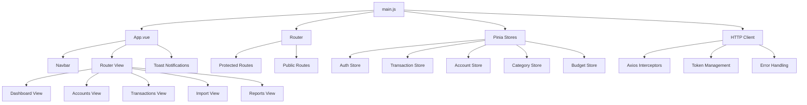

# Client-Side Architecture Documentation

## Overview

The client-side application is a **Vue.js 3 Single Page Application (SPA)** built with modern web technologies. It provides a comprehensive financial management interface with **responsive design**, **dark/light theme support**, and **real-time data synchronization**. The application follows **component-based architecture** with **Pinia state management** and **composable patterns** for code reusability.

## Technology Stack

### Core Technologies
- **Vue.js 3** - Progressive JavaScript framework with Composition API
- **Vite** - Fast build tool and development server
- **Pinia** - State management library for Vue.js
- **Vue Router 4** - Client-side routing
- **Axios** - HTTP client for API communication
- **Tailwind CSS** - Utility-first CSS framework
- **Chart.js** - Data visualization library

### Development Tools
- **PostCSS** - CSS processing
- **Autoprefixer** - CSS vendor prefixing
- **Vue Toastification** - Toast notification system

## Application Architecture

### Project Structure
```
client/
├── src/
│   ├── components/          # Reusable Vue components
│   ├── views/              # Page-level components
│   ├── stores/             # Pinia state management
│   ├── composables/        # Reusable composition functions
│   ├── router/             # Vue Router configuration
│   ├── lib/                # Utility libraries
│   ├── assets/             # Static assets
│   ├── App.vue             # Root component
│   └── main.js             # Application entry point
├── dist/                   # Built application
├── package.json            # Dependencies and scripts
├── vite.config.js          # Vite configuration
├── tailwind.config.js      # Tailwind CSS configuration
└── postcss.config.js       # PostCSS configuration
```

### Architecture Diagram


---

## Core Components

### Application Root (`App.vue`)

**Purpose**: Main application container with navigation and routing

**Key Features**:
- **Conditional Navigation**: Hides navbar on authentication pages
- **Theme Integration**: Dark/light mode support
- **Toast System**: Global notification management
- **Navigation Guards**: Change tracking protection

**Template Structure**:
```vue
<template>
  <div class="min-h-screen flex flex-col">
    <Navbar v-if="!isAuthPage" />
    <main class="flex-1">
      <router-view></router-view>
    </main>
    <ToastNotification />
  </div>
</template>
```

### Navigation Component (`Navbar.vue`)

**Purpose**: Primary navigation with responsive design and user management

**Key Features**:
- **Responsive Design**: Mobile-first with collapsible menu
- **Dropdown Menus**: Management and Reports sections
- **User Profile**: Avatar with initials and dropdown
- **Theme Toggle**: Dark/light mode switching
- **Admin Features**: Role-based navigation items

**Navigation Structure**:
- **Core**: Dashboard, Transactions, Accounts
- **Management**: Categories, Budgets, Statements
- **Reports**: Reports, Charts, Weekly Actuals
- **User**: Profile, Admin (if admin), Logout

### Protected Route Component (`ProtectedRoute.vue`)

**Purpose**: Authentication wrapper for protected pages

**Key Features**:
- **Authentication Check**: Verifies user login status
- **Loading States**: Shows spinner during auth verification
- **Access Denied**: User-friendly error page for unauthorized access
- **Redirect Logic**: Automatic redirect to login with return path

---

## State Management (Pinia Stores)

### Authentication Store (`auth.js`)

**Purpose**: Manages user authentication state and session

**State Properties**:
```javascript
{
  user: null,              // Current user data
  token: null,             // JWT access token (in-memory only)
  tokenExpiry: null,       // Token expiration timestamp
  refreshTimer: null,      // Auto-refresh timer
  isLoading: false,        // Loading state
  error: null              // Error messages
}
```

**Key Actions**:
- `login(userData, authToken)` - Authenticate user
- `logout()` - Clear session and all store data
- `refreshToken()` - Refresh access token using HTTP-only cookie
- `initializeAuth()` - Restore session on app startup
- `clearAllStoreData()` - Prevent cross-user data leakage

**Security Features**:
- **In-Memory Tokens**: No localStorage for JWT tokens (XSS protection)
- **HTTP-Only Cookies**: Refresh tokens stored securely
- **Token Rotation**: New refresh token on each refresh
- **Auto-Refresh**: Automatic token renewal before expiry
- **Data Isolation**: Complete store clearing on logout

### Transaction Store (`transaction.js`)

**Purpose**: Manages transaction data and CSV import functionality

**State Properties**:
```javascript
{
  transactions: [],        // Transaction list
  loading: false,          // Loading state
  lastFetchTime: null,     // Cache timestamp
  lastFetchParams: null,   // Cache parameters
  error: null,             // Error messages
  uploadProgress: 0,       // CSV upload progress
  csvPreview: [],          // CSV preview data
  csvHeaders: [],          // CSV column headers
  fieldMappings: {},       // Field mapping configuration
  duplicates: [],          // Duplicate detection results
  totalRecords: 0,         // Total CSV records
  duplicateCount: 0,       // Duplicate count
  importedCount: 0,        // Successfully imported count
  dateParseErrors: []      // Date parsing errors
}
```

**Key Actions**:
- `fetchTransactions(startDate, endDate)` - Load transactions with caching
- `createTransaction(transaction)` - Add new transaction
- `updateTransaction(id, transaction)` - Modify existing transaction
- `deleteTransaction(id)` - Remove transaction
- `batchDeleteTransactions(ids)` - Bulk delete operations
- `previewCSV(file, accountId)` - Preview CSV before import
- `uploadTransactions(file, mappings, accountId, categories, duplicates)` - Import CSV
- `saveFieldMappings(accountId, mappings)` - Save CSV field mappings

**Advanced Features**:
- **Smart Caching**: 30-second cache with parameter validation
- **Date Formatting**: Multiple date format support (DD/MM/YYYY, YYYY-MM-DD)
- **Duplicate Detection**: SHA-256 hash-based duplicate prevention
- **Field Mapping**: Flexible CSV column mapping
- **Progress Tracking**: Real-time upload progress
- **Error Handling**: Comprehensive error reporting

### Account Store (`account.js`)

**Purpose**: Manages financial account data and reconciliation

**State Properties**:
```javascript
{
  accounts: [],                    // Account list
  reconciliationSummary: [],       // Reconciliation data
  loading: false,                  // Loading state
  error: null                      // Error messages
}
```

**Key Actions**:
- `fetchAccounts()` - Load all user accounts
- `fetchReconciliationSummary()` - Get reconciliation status
- `getAccountById(id)` - Retrieve specific account
- `createAccount(account)` - Add new account
- `updateAccount(id, account)` - Modify account
- `deleteAccount(id)` - Remove account
- `updateAccountBalance(id, signed_amount)` - Update balance

### Category Store (`category.js`)

**Purpose**: Manages transaction categories with caching

**State Properties**:
```javascript
{
  categories: [],          // Category list
  loading: false,          // Loading state
  error: null,             // Error messages
  lastFetch: null,         // Cache timestamp
  cacheTimeout: 600000     // 10-minute cache
}
```

**Key Actions**:
- `fetchCategories(forceRefresh)` - Load categories with smart caching
- `getCategoryById(id)` - Retrieve specific category
- `createCategory(category)` - Add new category
- `updateCategory(id, category)` - Modify category
- `deleteCategory(id)` - Remove category
- `bulkCreateCategories(categories)` - Batch create categories

**Caching Strategy**:
- **10-minute cache** for categories (rarely change)
- **Cache invalidation** on create/update/delete operations
- **Force refresh** option for immediate updates

---

## Composables (Reusable Logic)

### Authentication Composable (`useAuth.js`)

**Purpose**: Provides authentication functionality and form management

**Key Features**:
- **Form Management**: Login, register, and profile forms
- **Validation**: Email, password, and username validation
- **API Integration**: Login, register, profile management
- **Error Handling**: User-friendly error messages

**Validation Rules**:
```javascript
// Email validation
const emailRegex = /^[^\s@]+@[^\s@]+\.[^\s@]+$/;

// Password validation (8+ chars, uppercase, lowercase, number)
const passwordRegex = /^(?=.*[a-z])(?=.*[A-Z])(?=.*\d)/;

// Username validation (3-50 chars, alphanumeric + underscore)
const usernameRegex = /^[a-zA-Z0-9_]{3,50}$/;
```

### Theme Composable (`useTheme.js`)

**Purpose**: Manages dark/light theme switching and persistence

**Key Features**:
- **Theme Persistence**: User preferences stored in backend
- **System Detection**: Automatic system theme detection
- **DOM Integration**: Automatic class application
- **Icon Management**: Dynamic theme icons

**Theme Management**:
```javascript
const applyTheme = (theme) => {
  const html = document.documentElement;
  if (theme === 'dark') {
    html.classList.add('dark');
    html.classList.remove('light');
  } else {
    html.classList.add('light');
    html.classList.remove('dark');
  }
};
```

### Toast Composable (`useToast.js`)

**Purpose**: Global notification system

**Key Features**:
- **Multiple Types**: Success, error, warning, info
- **Auto-Dismiss**: Configurable duration
- **Manual Control**: Programmatic removal
- **Queue Management**: Multiple toast support

**Usage**:
```javascript
const { success, error, warning, info } = useToast();
success('Operation completed successfully');
error('Something went wrong');
```

---

## Views (Page Components)

### Dashboard View (`DashboardView.vue`)

**Purpose**: Main application dashboard with financial overview

**Key Features**:
- **Account Filtering**: Multi-select account filtering
- **Summary Cards**: Total balance, income, expenses
- **Account Carousel**: Scrollable account summaries
- **Budget vs Actual**: Visual budget analysis
- **Real-time Data**: Live financial calculations

**Data Sources**:
- **Legacy Mode**: Client-side transaction calculations
- **Strict Mode**: Database actuals with feature flags
- **Hybrid Approach**: Automatic mode selection

**Financial Calculations**:
```javascript
// Total balance calculation
const totalBalance = computed(() => {
  if (actualsStore.strictActualsEnabled) {
    return actualsStore.totalAccountBalance; // DB actuals
  }
  return accountSummaries.value.reduce((sum, a) => 
    sum + (parseFloat(a.closingBalance) || 0), 0); // Legacy
});
```

### Login View (`LoginView.vue`)

**Purpose**: User authentication interface

**Key Features**:
- **Form Validation**: Real-time input validation
- **Loading States**: Visual feedback during authentication
- **Error Handling**: User-friendly error messages
- **Accessibility**: ARIA labels and keyboard navigation
- **Redirect Logic**: Return to intended page after login

**Security Features**:
- **Input Sanitization**: XSS protection
- **Rate Limiting**: Backend rate limiting
- **Secure Cookies**: HTTP-only refresh tokens

### Accounts View (`AccountsView.vue`)

**Purpose**: Account management interface

**Key Features**:
- **CRUD Operations**: Create, read, update, delete accounts
- **Modal Forms**: Inline editing with validation
- **Confirmation Dialogs**: Safe deletion with warnings
- **Data Formatting**: Currency and date formatting
- **Responsive Table**: Mobile-friendly account listing

### Transaction Import View (`TransactionImport.vue`)

**Purpose**: CSV import wizard with multi-step process

**Key Features**:
- **Step-by-Step Wizard**: 5-step import process
- **Account Selection**: Choose target account
- **File Upload**: Drag-and-drop CSV upload
- **Field Mapping**: Map CSV columns to transaction fields
- **Category Assignment**: Assign categories to transactions
- **Duplicate Detection**: Identify and handle duplicates
- **Progress Tracking**: Real-time upload progress

**Import Process**:
1. **Select Account** - Choose target account
2. **Upload File** - CSV file selection
3. **Map Fields** - Column mapping configuration
4. **Assign Categories** - Category selection for each transaction
5. **Review & Import** - Final review and import execution

**Advanced Features**:
- **Smart Defaults**: Previous mapping restoration
- **Auto-Categorization**: AI-powered category suggestions
- **Duplicate Handling**: Flexible duplicate management
- **Error Reporting**: Detailed import error feedback
- **Progress Indicators**: Visual progress tracking

---

## HTTP Client and API Integration

### HTTP Client (`http.js`)

**Purpose**: Centralized HTTP client with caching and authentication

**Key Features**:
- **Conditional GET**: ETag and Last-Modified support
- **Request Deduplication**: Prevents duplicate API calls
- **Token Management**: Automatic JWT token injection
- **Error Mapping**: Consistent error handling
- **Cache Management**: In-memory response caching

**Caching Strategy**:
```javascript
// Conditional request headers
if (cached.etag) {
  config.headers['If-None-Match'] = cached.etag;
}
if (cached.lastModified) {
  config.headers['If-Modified-Since'] = cached.lastModified;
}

// 304 Not Modified handling
if (response.status === 304 && response.config._cachedData) {
  return {
    ...response,
    data: response.config._cachedData,
    status: 200,
    fromCache: true
  };
}
```

### Axios Configuration (`main.js`)

**Purpose**: Global HTTP client configuration with interceptors

**Key Features**:
- **Token Injection**: Automatic JWT token attachment
- **Token Refresh**: Automatic token renewal on 401 errors
- **Error Handling**: Global error response handling
- **Request/Response Interceptors**: Centralized request processing

**Security Implementation**:
```javascript
// Request interceptor - token injection
axios.interceptors.request.use((config) => {
  const token = authStore.token; // In-memory token only
  if (token) {
    config.headers.Authorization = `Bearer ${token}`;
  }
  return config;
});

// Response interceptor - token refresh
axios.interceptors.response.use(
  (response) => response,
  async (error) => {
    if (error.response?.status === 401 && !error.config._retry) {
      error.config._retry = true;
      const newToken = await authStore.refreshToken();
      if (newToken) {
        error.config.headers.Authorization = `Bearer ${newToken}`;
        return axios(error.config);
      }
      authStore.logout();
      router.push('/login');
    }
    return Promise.reject(error);
  }
);
```

---

## Routing and Navigation

### Router Configuration (`router/index.js`)

**Purpose**: Client-side routing with authentication guards

**Route Structure**:
```javascript
const routes = [
  // Public routes
  { path: '/login', name: 'login', component: LoginView },
  { path: '/register', name: 'register', component: RegisterView },
  
  // Protected routes
  {
    path: '/',
    component: ProtectedRoute,
    children: [
      { path: '', name: 'dashboard', component: DashboardView },
      { path: '/profile', name: 'profile', component: ProfileView },
      { path: '/admin', name: 'admin', component: DatabaseAdmin, meta: { requiresAdmin: true } },
      { path: '/users', name: 'user-management', component: UserManagementView, meta: { requiresAdmin: true } },
      { path: '/categories', name: 'categories', component: CategoriesView },
      { path: '/accounts', name: 'accounts', component: AccountsView },
      { path: '/import', name: 'import', component: TransactionImport },
      { path: '/transactions', name: 'transactions', component: TransactionsView },
      { path: '/budgets', name: 'budgets', component: BudgetsView },
      { path: '/reports', name: 'reports', component: ReportsView },
      { path: '/charts', name: 'charts', component: ChartsView },
      { path: '/statements', name: 'statements', component: StatementsView },
      { path: '/weekly-actuals', name: 'weekly-actuals', component: WeeklyActualsView }
    ]
  }
];
```

**Navigation Guards**:
- **Authentication Check**: Verifies user login status
- **Role-Based Access**: Admin-only route protection
- **Redirect Logic**: Automatic redirect to login with return path
- **Route Meta**: Additional route metadata for access control

---

## Styling and Theming

### Tailwind CSS Integration

**Purpose**: Utility-first CSS framework with custom configuration

**Key Features**:
- **Dark Mode**: Automatic dark/light theme switching
- **Responsive Design**: Mobile-first responsive breakpoints
- **Custom Components**: Reusable component classes
- **Color System**: Consistent color palette

**Dark Mode Implementation**:
```css
/* Automatic dark mode classes */
html {
  @apply bg-white dark:bg-gray-900;
}

body {
  @apply bg-white dark:bg-gray-900 text-gray-900 dark:text-white;
}

/* Form elements */
input, select, textarea {
  @apply bg-white dark:bg-gray-800 text-gray-900 dark:text-white border-gray-300 dark:border-gray-600;
}
```

### Component Styling

**Navigation Styles**:
```css
.nav-link {
  @apply inline-flex items-center px-1 pt-1 border-b-2 border-transparent text-sm font-medium text-gray-500 dark:text-gray-400 hover:text-gray-700 dark:hover:text-gray-300 hover:border-gray-300 dark:hover:border-gray-600 transition-colors;
}

.nav-link-active {
  @apply border-blue-500 text-gray-900 dark:text-white;
}
```

**Mobile Navigation**:
```css
.mobile-nav-link {
  @apply block px-3 py-2 rounded-md text-base font-medium text-gray-500 dark:text-gray-400 hover:text-gray-700 dark:hover:text-gray-300 hover:bg-gray-50 dark:hover:bg-gray-700 transition-colors;
}
```

---

## Performance Optimizations

### Caching Strategies

**Store-Level Caching**:
- **Transaction Store**: 30-second cache with parameter validation
- **Category Store**: 10-minute cache (categories rarely change)
- **Account Store**: Real-time data (frequent updates)

**HTTP Caching**:
- **Conditional GET**: ETag and Last-Modified headers
- **304 Not Modified**: Serves cached data when unchanged
- **Request Deduplication**: Prevents duplicate API calls

### Lazy Loading

**Route-Based Code Splitting**:
```javascript
// Lazy-loaded components
const DashboardView = () => import('../views/DashboardView.vue');
const AccountsView = () => import('../views/AccountsView.vue');
```

**Component Lazy Loading**:
- **Modal Components**: Loaded on demand
- **Chart Components**: Loaded when needed
- **Admin Components**: Loaded only for admin users

### Data Optimization

**Smart Data Fetching**:
- **Debounced Requests**: Prevents cascading API calls
- **Batch Operations**: Multiple operations in single requests
- **Incremental Updates**: Only fetch changed data
- **Background Refresh**: Automatic data synchronization

---

## Security Implementation

### Authentication Security

**Token Management**:
- **In-Memory Tokens**: JWT tokens stored in memory only (XSS protection)
- **HTTP-Only Cookies**: Refresh tokens in secure cookies
- **Token Rotation**: New refresh token on each refresh
- **Automatic Expiry**: Token expiration handling

**Session Management**:
- **Secure Logout**: Complete data clearing on logout
- **Cross-User Protection**: Prevents data leakage between users
- **Session Restoration**: Automatic session recovery on app restart

### Input Validation

**Client-Side Validation**:
- **Form Validation**: Real-time input validation
- **XSS Protection**: Input sanitization
- **Type Checking**: Data type validation
- **Length Limits**: Input length restrictions

**API Security**:
- **Request Interceptors**: Automatic token injection
- **Response Interceptors**: Error handling and token refresh
- **CORS Configuration**: Cross-origin request handling
- **Rate Limiting**: Backend rate limiting integration

---

## Error Handling and User Experience

### Error Management

**Global Error Handling**:
- **HTTP Errors**: Centralized error processing
- **Validation Errors**: Form-specific error display
- **Network Errors**: Offline/connection error handling
- **User Feedback**: Toast notifications for all errors

**Error Recovery**:
- **Retry Logic**: Automatic retry for failed requests
- **Fallback Data**: Cached data when API fails
- **Graceful Degradation**: Partial functionality when errors occur

### User Experience Features

**Loading States**:
- **Skeleton Screens**: Content placeholders during loading
- **Progress Indicators**: Upload and operation progress
- **Spinner Animations**: Visual feedback for operations

**Responsive Design**:
- **Mobile-First**: Optimized for mobile devices
- **Touch-Friendly**: Large touch targets
- **Adaptive Layout**: Responsive grid systems
- **Collapsible Navigation**: Mobile menu optimization

**Accessibility**:
- **ARIA Labels**: Screen reader support
- **Keyboard Navigation**: Full keyboard accessibility
- **Color Contrast**: WCAG compliant color schemes
- **Focus Management**: Proper focus handling

---

## Development and Build Process

### Development Setup

**Vite Configuration**:
```javascript
export default defineConfig({
  plugins: [vue()],
  resolve: {
    alias: {
      '@': path.resolve(__dirname, './src'),
    },
  },
  server: {
    port: 8085,
    proxy: {
      '/api': {
        target: 'http://localhost:3050',
        changeOrigin: true,
      },
    },
  },
});
```

**Development Scripts**:
- `npm start` - Development server
- `npm run build` - Production build
- `npm run preview` - Preview production build

### Build Optimization

**Production Build**:
- **Code Splitting**: Automatic route-based splitting
- **Tree Shaking**: Unused code elimination
- **Minification**: JavaScript and CSS minification
- **Asset Optimization**: Image and font optimization

**Bundle Analysis**:
- **Chunk Analysis**: Bundle size monitoring
- **Dependency Tracking**: Package size analysis
- **Performance Metrics**: Build time optimization

---

## Summary

The client-side application provides a comprehensive, modern financial management interface with:

### **Architecture Highlights**
- **Vue.js 3** with Composition API for modern reactive development
- **Pinia** for efficient state management with TypeScript-like patterns
- **Component-Based Design** with reusable composables
- **Responsive Design** with Tailwind CSS and dark mode support

### **Key Features**
- **Secure Authentication** with JWT tokens and HTTP-only cookies
- **Real-Time Data** with smart caching and automatic refresh
- **Advanced CSV Import** with field mapping and duplicate detection
- **Financial Analytics** with budget vs actual analysis
- **Mobile-First Design** with touch-friendly interfaces

### **Performance Optimizations**
- **Smart Caching** with conditional GET requests
- **Lazy Loading** for routes and components
- **Request Deduplication** to prevent unnecessary API calls
- **Background Sync** for seamless data updates

### **Security Implementation**
- **XSS Protection** with in-memory token storage
- **CSRF Protection** with secure cookie handling
- **Input Validation** with client and server-side checks
- **Data Isolation** with complete user data separation

The application provides a robust, scalable foundation for financial management with modern web development best practices, comprehensive security measures, and excellent user experience across all devices.
